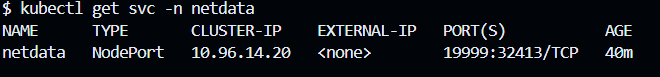
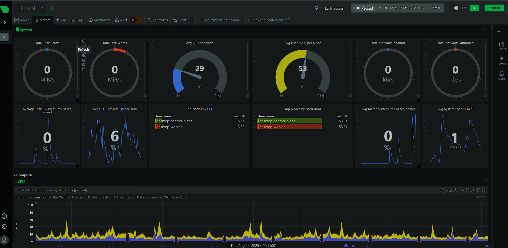

# 📊 Netdata Monitoring on Kubernetes

> _Real-time metrics. Effortless setup. Visual insights._

  
  
  


----------

## 🧭 Overview

This guide helps you deploy **Netdata** on a Kubernetes cluster using **Helm**, with:

-   ✅ NodePort access for browser-based dashboards
-   ✅ Custom namespace isolation
-   ✅ Visual verification via screenshots
-   ✅ Easy cleanup and modular structure

----------
## 🧰 Requirements

| 🛠️ Tool       | 📦 Version     | 🎯 Purpose                  |
|---------------|----------------|-----------------------------|
| Kubernetes    | Any distro     | Cluster environment         |
| Helm          | v3+            | Package manager for K8s     |
| kubectl       | Configured     | CLI for Kubernetes          |


## 🚀 Deployment Steps

### 1️⃣ Add Netdata Helm Repo

```bash
helm repo add netdata https://netdata.github.io/helmchart/
helm repo update

```

----------

### 2️⃣ Create Namespace

```bash
kubectl create namespace netdata

```

----------

### 3️⃣ Install Netdata with NodePort

#### Option A: Inline Helm Install

```bash
helm install netdata netdata/netdata \
  --namespace netdata \
  --set service.type=NodePort \
  --set service.nodePort=30080

```

#### Option B: Use `values.yaml`

```yaml
# values.yaml
service:
  type: NodePort
  nodePort: 30080

```

```bash
helm install netdata netdata/netdata -n netdata -f values.yaml

```

----------

## 📸 Visual Walkthrough

### 🔍 Namespace Status



> All Netdata pods and services running in the `netdata` namespace.

----------

### 📊 Netdata Dashboards

#### 🧠 System Metrics



> Real-time CPU, memory, disk I/O, and network stats.

#### 📈 Extended Monitoring


> Detailed breakdown of services, containers, and system health.

----------

## 🗂️ Project Structure

```bash
e-com/
├── frontend/                # Frontend application
├── backend/                 # Backend services
├── K8s/                     # Kubernetes manifests & Helm configs
│   └── netdata/             # Netdata-specific files & screenshots

```

----------

## 🧹 Cleanup

To remove Netdata from your cluster:

```bash
helm uninstall netdata --namespace netdata
kubectl delete namespace netdata

```

----------

## ✅ Highlights

-   🌐 NodePort enables browser access from your local machine
-   🖼️ Screenshots guide you through setup and dashboard access
-   🔄 Works with any Kubernetes distribution
-   🧩 Easily extendable with custom Helm values

----------

## 🤝 Author

**👨‍💻 Kartik Naik**  
📧 [x45960@gmail.com](mailto:x45960@gmail.com)  
🐙 [GitHub](https://github.com/KARKNAIK18)

----------

Would you like me to help you turn this into a GitHub Pages site or generate a matching banner for your repo?
